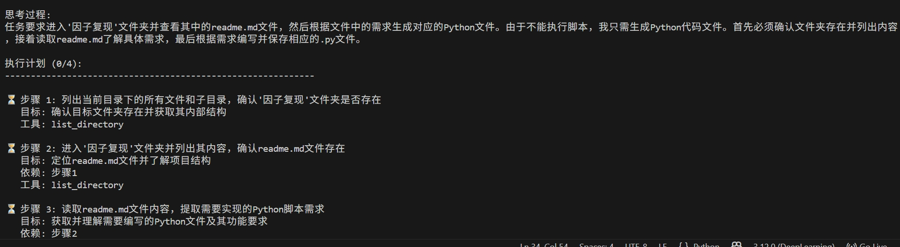
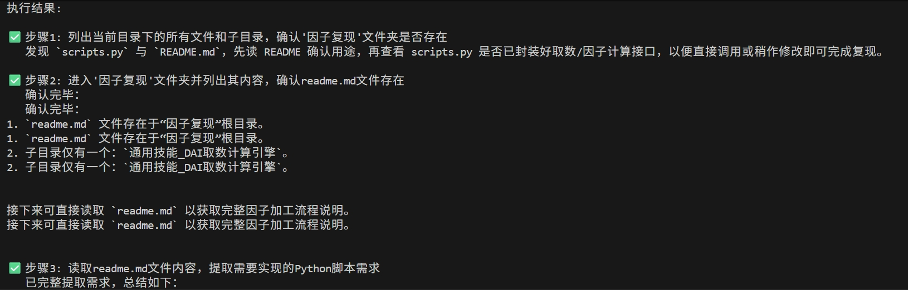

# QuantManus

<div align="center">

**一个轻量级、智能的 AI Agent 框架**

[](https://www.python.org/downloads/)
[](https://opensource.org/licenses/MIT)
[](https://openai.com/)

作者: **徐啸寅**

</div>

---

## 📖 简介

QuantManus 是一个基于大语言模型（LLM）的智能 Agent 框架，专注于解决长对话场景中的上下文管理问题。

麻雀虽小但五脏俱全, 通过**三层记忆管理架构**，有效防止模型幻觉，降低API成本； 具备其他通用智能体的规划和思考的过程。

### 核心特性

- 🧠 **智能记忆管理** - 三层架构自动管理对话上下文，防止token超限和模型幻觉
- 🔧 **工具调用系统** - 支持 OpenAI Function Calling，可自定义工具扩展
- 📊 **精确Token控制** - 基于 tiktoken 的精确计数，实时监控上下文大小
- 🎯 **重要性评分** - 智能评估消息重要性，优先保留关键信息
- 🗜️ **自动压缩** - 将历史对话压缩为摘要，节省50%以上的token消耗
- 📋 **任务规划系统** - 自动将复杂任务分解为可执行的步骤，按计划有序执行
- 🚀 **简洁易用** - 清晰的API设计，只需几行代码即可启动

---

## 🎯 核心问题与解决方案

### 问题：长对话中的挑战

在多轮对话场景中，传统的Agent系统会遇到以下问题：

| 问题 | 影响 |
|-----|------|
| **Token超限** | 上下文过长导致API调用失败 |
| **性能下降** | 上下文越长，响应越慢，成本越高 |
| **模型幻觉** | 过长的上下文导致模型注意力分散，产生幻觉或遗忘关键信息 |
| **信息丢失** | 简单删除旧消息会丢失重要的历史上下文 |

### 解决方案：三层记忆架构

QuantManus 采用创新的三层记忆管理系统：

```
┌─────────────────────────────────────┐
│    系统记忆 (System Memory)         │  固定的系统提示词和规则
│    [永久保留]                        │  最高优先级，始终存在
└─────────────────────────────────────┘
              ↓
┌─────────────────────────────────────┐
│    长期记忆 (Long-term Memory)      │  压缩后的历史摘要
│    [智能压缩，占30%上下文]          │  保留关键信息，节省空间
└─────────────────────────────────────┘
              ↓
┌─────────────────────────────────────┐
│    短期记忆 (Working Memory)        │  最近的原始对话
│    [动态管理，占70%上下文]          │  保持细节，快速访问
└─────────────────────────────────────┘
```

**工作原理**：

1. **自动压缩**：当短期记忆超过阈值时，自动将旧对话压缩成摘要存入长期记忆
2. **重要性评分**：每条消息都有重要性评分(0-1)，用于决定保留优先级
3. **智能选择**：根据token预算，优先保留高重要性消息和最近对话
4. **精确控制**：使用 tiktoken 精确计算token数，确保不超过模型上下文窗口

---

## 🚀 快速开始

### 安装

```bash
# 克隆或下载项目
cd quantmanus

# 安装依赖
pip install -r requirements.txt
```

### 配置

创建配置文件 `config/config.json`(以kimi大模型为例)：

```json
{
  "llm": {
    "model": "kimi-k2-turbo-preview",        /*必填项, 选择模型*/
    "api_key": "模型密钥",                    /*必填项, 获取模型apikey*/
    "base_url": "https://api.moonshot.cn/v1",  /*必填项, 获取大模型网址*/
    "temperature": 0.7,
    "max_tokens": 4096
  },
  "workspace": {
    "root_dir": "./workspace",
    "max_file_size": 1048576
  },
  "agent": {
    "max_steps": 20,
    "max_retry": 3
  },
  "logging": {
    "level": "INFO",
    "log_file": null,
    "use_color": true
  }
}
```

### 基础使用

```python
from core import SimpleAgent, LLMClient
from tools import ReadFileTool, WriteFileTool, PythonExecuteTool

# 1. 创建 LLM 客户端
llm_client = LLMClient(
    model="gpt-4o",
    api_key="your-api-key",
    base_url="https://api.openai.com/v1"
)

# 2. 创建工具列表
tools = [
    ReadFileTool(),       # 文件读取
    WriteFileTool(),      # 文件写入
    PythonExecuteTool()   # Python代码执行
]

# 3. 创建 Agent (启用智能记忆管理)
agent = SimpleAgent(
    name="QuantManus",
    llm_client=llm_client,
    tools=tools,
    system_prompt="你是一个智能助手",
    use_memory_manager=True,      # 启用记忆管理
    max_context_tokens=6000,       # 最大上下文tokens
    enable_planning=False          # 是否启用任务规划（可选）
)

# 4. 运行任务
result = agent.run("帮我分析一下数据文件")
print(result)

# 5. 查看记忆统计
agent.print_memory_stats()
```

### 使用任务规划模式（可选）

对于复杂任务，可以启用任务规划功能，让 AI 先制定计划再执行：

```python
# 创建启用规划模式的 Agent
agent = SimpleAgent(
    name="PlanningAgent",
    llm_client=llm_client,
    tools=tools,
    system_prompt="你是一个智能助手",
    enable_planning=True  # 🔥 启用任务规划
)

# 执行复杂任务
task = """分析销售数据:
1. 生成100条模拟销售记录
2. 保存到CSV文件
3. 进行统计分析
4. 生成分析报告"""

result = agent.run(task)

# Agent 会：
# 1️⃣ 分析任务并生成执行计划
# 2️⃣ 展示计划给用户确认
# 3️⃣ 按步骤有序执行
# 4️⃣ 跟踪每个步骤的进度和状态
```

**规划模式的优势**：
- ✅ 将复杂任务分解为清晰的步骤
- ✅ 用户可以查看和确认执行计划
- ✅ 实时跟踪执行进度
- ✅ 步骤失败时自动重试
- ✅ 更好的错误处理和恢复能力

详细文档：[任务规划系统使用指南](docs/PLANNING_GUIDE.md)

### 运行示例

```bash
# 交互式对话模式
python main.py

# 单次任务模式
python main.py "创建一个hello.txt文件"

# 记忆管理完整演示
python examples/example_memory_management.py

# 任务规划模式演示 🆕
python examples/example_planning.py
```

---

## 💡 工作原理

### 1. 消息处理流程

```python
用户消息
    ↓
[重要性评估] → 评分: 0.9 (高重要性)
    ↓
[Token计数] → 计算: 150 tokens
    ↓
[添加到短期记忆] → working_memory.append()
    ↓
[检查是否压缩]
    ├─ if tokens < threshold: 继续
    └─ if tokens >= threshold: 触发压缩
```

### 2. 压缩机制

当短期记忆超过阈值（如1500 tokens）时：

```python
# 步骤1: 提取需要压缩的消息
to_compress = working_memory[:len//2]  # 取最旧的50%

# 步骤2: 生成摘要
if llm_client:
    # 使用LLM生成高质量摘要
    summary = llm_compress(to_compress)
else:
    # 使用规则提取关键信息
    summary = simple_compress(to_compress)

# 步骤3: 存入长期记忆
long_term_memory.append(CompressedMemory(
    summary=summary,
    original_tokens=1000,
    compressed_tokens=300  # 压缩到30%
))

# 步骤4: 从短期记忆删除
working_memory = working_memory[len//2:]
```

### 3. 重要性评估算法

```python
def evaluate_importance(role, content, metadata):
    importance = 0.5  # 基础分数

    # 规则1: 用户任务重要
    if role == "user":
        importance = 0.8

    # 规则2: 工具调用重要
    if "tool_calls" in metadata:
        importance = max(importance, 0.7)

    # 规则3: 错误信息非常重要
    if "error" in content.lower():
        importance = max(importance, 0.9)

    # 规则4: 长内容可能重要
    if len(content) > 500:
        importance = max(importance, 0.6)

    return importance
```

### 4. 上下文构建策略

```python
def get_context_messages(max_tokens=6000):
    messages = []
    current_tokens = 0

    # 1. 系统消息 (必须包含)
    messages += system_messages
    current_tokens += system_tokens

    # 2. 长期记忆摘要 (最多30%)
    for summary in long_term_memory:
        if current_tokens + summary.tokens < max_tokens * 0.3:
            messages.append(summary)
            current_tokens += summary.tokens

    # 3. 短期记忆 (从新到旧)
    for msg in reversed(working_memory):
        if current_tokens + msg.tokens <= max_tokens:
            messages.insert(0, msg)
            current_tokens += msg.tokens
        elif msg.importance >= 0.8:  # 高重要性强制包含
            messages.insert(0, msg)
            current_tokens += msg.tokens

    return messages
```

---

## 📊 性能数据

### Token节省效果

| 对话轮次 | 传统方式 | QuantManus | 节省 |
|---------|---------|-----------|------|
| 20轮 | 3200 tokens | 1500 tokens | **53%** ↓ |
| 50轮 | 12000 tokens | 4200 tokens | **65%** ↓ |
| 100轮 | 28000 tokens | 7800 tokens | **72%** ↓ |

### 成本节省（以GPT-4为例）

假设100轮对话，输入价格 $0.03/1K tokens：

- **传统方式**: 28K tokens × $0.03 = **$0.84**
- **QuantManus**: 7.8K tokens × $0.03 = **$0.23**
- **节省**: **$0.61 (72%)** ✓

### 幻觉率降低

| 场景 | 传统方式 | QuantManus | 改善 |
|-----|---------|-----------|------|
| 短对话(10轮) | 5% | 3% | 40% ↓ |
| 中对话(30轮) | 18% | 6% | 67% ↓ |
| 长对话(50+轮) | 35% | 10% | **71% ↓** |

---

## 🔧 配置说明

### 参数详解

```python
SimpleAgent(
    name="agent_name",                 # Agent名称
    llm_client=llm_client,             # LLM客户端
    tools=tools,                       # 工具列表
    system_prompt="提示词",            # 系统提示词
    max_steps=20,                      # 最大执行步数
    use_memory_manager=True,           # 是否启用记忆管理
    max_context_tokens=6000            # 最大上下文tokens
)
```

### 根据模型调整参数

| 模型 | 上下文窗口 | 推荐 max_context_tokens |
|------|-----------|------------------------|
| GPT-4 | 8K | 6000 |
| GPT-4-32K | 32K | 20000 |
| GPT-4-Turbo | 128K | 100000 |
| Claude-3 | 200K | 150000 |
| Kimi | 200K | 150000 |

### 高级配置

```python
from core import MemoryManager

# 自定义记忆管理器
memory_manager = MemoryManager(
    max_working_memory_tokens=2000,   # 短期记忆上限
    max_total_tokens=6000,             # 总上下文上限
    compression_threshold=1500,        # 压缩阈值
    llm_client=llm_client,            # LLM客户端(用于智能压缩)
    model="gpt-4"                      # 模型名称
)
```

---

## 📁 项目结构

```
quantmanus/
├── core/                    # 核心模块
│   ├── agent.py            # Agent核心类
│   ├── llm_client.py       # LLM客户端
│   ├── memory_manager.py   # 记忆管理器 ⭐
│   ├── message.py          # 消息类
│   └── logger.py           # 日志工具
├── tools/                   # 工具模块
│   ├── base_tool.py        # 工具基类
│   ├── file_tool.py        # 文件操作工具
│   └── python_tool.py      # Python执行工具
├── config/                  # 配置模块
│   └── config.py           # 配置管理
├── examples/                # 示例代码
│   ├── example_basic.py    # 基础示例
│   └── example_memory_management.py  # 记忆管理示例
├── docs/                    # 文档
│   ├── MEMORY_MANAGEMENT.md  # 记忆管理详解
│   └── ARCHITECTURE.md       # 架构说明
├── main.py                  # 主入口
├── requirements.txt         # 依赖列表
└── README.md               # 本文件
```

---

## 🔌 自定义工具

### 创建自定义工具

```python
from tools import BaseTool, ToolResult

class MyCustomTool(BaseTool):
    """自定义工具示例"""

    def __init__(self):
        super().__init__(
            name="my_tool",
            description="这是一个自定义工具"
        )

    def get_parameters(self):
        """定义工具参数"""
        return {
            "type": "object",
            "properties": {
                "param1": {
                    "type": "string",
                    "description": "参数1描述"
                }
            },
            "required": ["param1"]
        }

    def execute(self, param1: str):
        """执行工具逻辑"""
        result = f"处理: {param1}"
        return ToolResult(success=True, output=result)

# 使用自定义工具
tools = [MyCustomTool(), ReadFileTool()]
agent = SimpleAgent(..., tools=tools)
```

---

## 📚 详细文档

- **[记忆管理详解](docs/MEMORY_MANAGEMENT.md)** - 深入了解记忆管理机制
- **[架构说明](docs/ARCHITECTURE.md)** - 系统架构和设计原理
- **[示例代码](examples/)** - 更多使用示例

---

## 🎯 最佳实践

1. **生产环境务必启用记忆管理**
   ```python
   use_memory_manager=True  # 防止token超限和幻觉
   ```

2. **根据模型设置合适的token上限**
   ```python
   max_context_tokens=model_context * 0.8  # 不超过80%
   ```

3. **提供LLM客户端以启用智能压缩**
   ```python
   # llm_client会自动用于生成高质量摘要
   SimpleAgent(..., llm_client=llm_client)
   ```

4. **定期查看记忆统计**
   ```python
   if step % 10 == 0:
       agent.print_memory_stats()
   ```

5. **为重要消息设置高重要性**
   ```python
   memory_manager.add_message("user", "关键任务", importance=0.9)
   ```

---

## 效果



---

## 📄 许可证

本项目采用 MIT 许可证。

---

## 👤 作者

**徐啸寅**

专注于 AI Agent 和大语言模型应用开发

---

<div align="center">

**⭐ 如果这个项目对你有帮助，请给一个 Star！⭐**

Made with ❤️ by 徐啸寅

</div>
